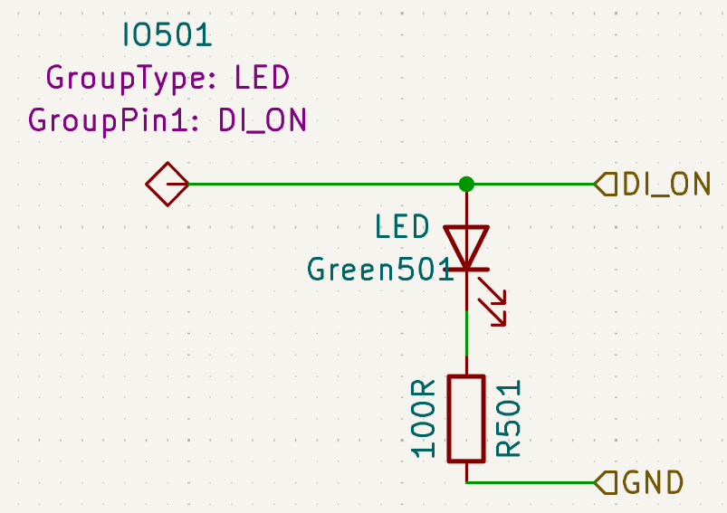

# kicad_firmware_generation: Extract Information from KiCad Schematics and Generate Firmware
When you design hardware, you often develop firmware, too.
That firmware needs to know which controller pin controls what functionality.
So you adapt the firmware to the specific hardware, e.g., with a pin definition C header.
What if you didn't have to do so manually?
kicad_firmware_generation is a tool suite for generating (parts of) the firmware based on information from KiCad schematics.<br />
What even is a single functionality the controller cares about?
Typically a group of components perform a function the firmware controls.
Therefore, kicad_firmware_generation thinks in **Group**s, each representing multiple components.
Our **Group Netlist XML** file format stores this information of your KiCad schematic:
What Groups are there and how are they connected?<br />
You only need to add annotations like these:


There are four programs around the Group Netlist:
1. kicad_group_netlister: Extract Information from your KiCad schematics and create a Group Netlist XML file.
2. code_gen: Take your Jinja2 template, hand it the information from the Group Netlist and generate your firmware or any other file:
    C++, Rust, HTML or Markdown Documentation or maybe even some SVG for your child to play with?
    The sky is the limit!
    Actually, we are the DLR, soo...why not build a satellite with this?
3. group_netlist_merger: When you have multiple schematics connected together, just merge their Group Netlists.
4. netlist_to_csv: Convert a Group Netlist into a spreadsheet; for those who like spreadsheets.


The [common_types](./common_types) directory contains an independent library to parse, handle and serialise a Group Netlist
If you have a use-case we haven't yet come up with, that's a place to start.

### Installation
- Install KiCad, Python and Jinja2: `sudo apt install kicad python3 python3-jinja2`
- `git clone https://github.com/DLR-RY/kicad_firmware_generation`
- `cd kicad_firmware_generation`
- `python3 -m pip install -e .`

### Quick Start
Give every component of interest the `GroupType` field in KiCad and use `GroupPin1`, `GroupPin2`, ... to give every pin a name.
Components with the same Group Type on the same sheet belong to the same Group.
The Group will have all its components' pins with an associated `GroupPinx` field.<br />
Alternatively, use the example in the [example](./example) dir.
Also, take a look at [example.kicad_pro](./example/schematics/example.kicad_pro).
It contains some annotations.
The below command work directly when you've entered the example dir.

1. Create a KiCad Netlist.
Replace `your_schematics.kicad_sch` with the path to your root schematics file.
KiCad will read all components on subsheets, too.
```
kicad-cli sch export netlist --format kicadxml --output kicad_netlist.xml schematics/example.kicad_sch
```

2. Convert into Group Netlist.
```
python3 -m kicad_group_netlister.kicad_group_netlister --lenient-names --output group_netlist.xml kicad_netlist.xml
```

3. Generate Firmware from Jinja2 Template.
```
python3 -m code_gen.code_gen --output pindefs.h group_netlist.xml template.jinja2
```
Use the `--help` flag on any tool and check out the preprint thesis below for more information.

### Merging multiple Group Netlists
```
# Merge two Group Netlists.
python3 -m group_netlist_merger.group_netlist_merger \
    --connect-group-glob 'MyFirstSchematic/Group1,MyFirstSchematic/Group2' \
    even_odd first_group_netlist.xml second_group_netlist > combined_group_netlist.xml
```
We explain the arguments in the preprint below.

### Convert Group Netlist to CSV
```
python3 -m netlist_to_csv.netlist_to_csv group_netlist.xml
    --root-group-glob '**/Connector*' \
    --simplify-pins 'GND' > ${GENERATED_DIR}/connectors.csv
```
We explain the arguments in the preprint below.

## Thesis Preprint
We are in the process of writing a thesis about kicad_firmware_generation.
[Our preprint (in kicad_firmware_generation_preprint.pdf)](./kicad_firmware_generation_preprint.pdf) contains detailed information on tool use, implementation and the Group Netlist specification.
Especially section 4.1 and below are interesting to users.
However, there are still major chapters missing.
Also, while we publish all other files under the [MIT license](./LICENSE), we reserve all rights to this file.
