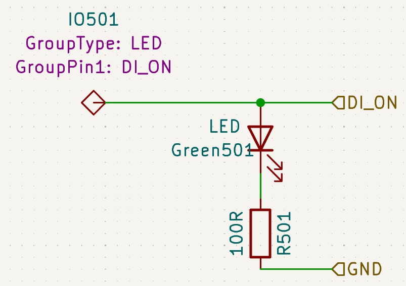
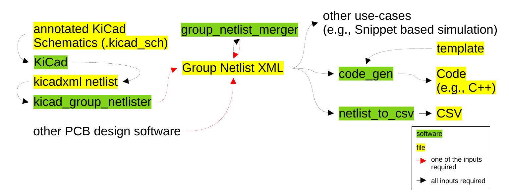

# kicad_firmware_generation: Extract Information from KiCad Schematics and Generate Firmware
When you design hardware, you often develop firmware, too.
That firmware needs to know which controller pin controls what functionality.
So you adapt the firmware to the specific hardware, e.g., with a pin definition C header.
What if you didn't have to do so manually?
kicad_firmware_generation is a tool suite for generating (parts of) the firmware based on information from KiCad schematics.<br />
What even is a single functionality the controller cares about?
Typically a group of components perform a function the firmware controls.
Therefore, kicad_firmware_generation thinks in **Group**s, each representing multiple components.
Our **Group Netlist XML** file format stores this information of your KiCad schematic:
What Groups are there and how are they connected?<br />
You only need to add annotations like these:


There are four programs around the Group Netlist:
1. kicad_group_netlister: Extract Information from your KiCad schematics and create a Group Netlist XML file (see [example/group_netlist.xml](./example/group_netlist.xml)).
2. code_gen: Take your Jinja2 template, hand it the information from the Group Netlist and generate your firmware or any other file:
    C++, Rust, HTML or Markdown Documentation or maybe even some SVG for your child to play with?
    The sky is the limit!
    Actually, we are the DLR, soo...why not build a satellite with this?
3. group_netlist_merger: When you have multiple schematics connected together, just merge their Group Netlists.
4. netlist_to_csv: Convert a Group Netlist into a spreadsheet; for those who like spreadsheets.



The [common_types](./common_types) directory contains an independent library to parse, handle and serialise a Group Netlist
If you have a use-case we haven't yet come up with, that's a place to start.

### Installation
- Install KiCad, Python and Jinja2: `sudo apt install kicad python3 python3-jinja2`
- `git clone https://github.com/DLR-RY/kicad_firmware_generation`
- `cd kicad_firmware_generation`
- `python3 -m pip install -e .`

### Quick Start
Give every component of interest the `GroupType` field in KiCad and use `GroupPin1`, `GroupPin2`, ... to give every pin a name.
Components with the same Group Type on the same sheet belong to the same Group.
The Group will have all its components' pins with an associated `GroupPinx` field.<br />
Alternatively, use the example in the [example](./example) dir.
Also, take a look at [example.kicad_pro](./example/schematics/example.kicad_pro).
It contains some annotations.
The below command work directly when you've entered the example dir.

1. Create a KiCad Netlist.
Replace `your_schematics.kicad_sch` with the path to your root schematics file.
KiCad will read all components on subsheets, too.
```
kicad-cli sch export netlist --format kicadxml --output kicad_netlist.xml schematics/example.kicad_sch
```

2. Convert into Group Netlist.
```
python3 -m kicad_group_netlister.kicad_group_netlister --lenient-names --output group_netlist.xml kicad_netlist.xml
```
You'll have to add the `--strip-trailing-pinfunction` flag when you're using KiCad 10 or newer.

3. Generate Firmware from Jinja2 Template.
```
python3 -m code_gen.code_gen --output pindefs.h group_netlist.xml template.jinja2
```
Use the `--help` flag on any tool and check out the preprint thesis below for more information.

### Merging multiple Group Netlists
```
# Merge two Group Netlists.
python3 -m group_netlist_merger.group_netlist_merger \
    --connect-group-glob 'MyFirstSchematic/Group1,MySecondSchematic/Group2' \
    even_odd first_group_netlist.xml second_group_netlist > combined_group_netlist.xml
```
We explain the arguments in the preprint below.

### Convert Group Netlist to CSV
```
python3 -m netlist_to_csv.netlist_to_csv group_netlist.xml
    --root-group-glob '**/Connector*' \
    --simplify-pins 'GND' > ${GENERATED_DIR}/connectors.csv
```
We explain the arguments in the preprint below.

## Thesis Preprint
We wrote [a thesis](https://chris-besch.com/articles/kicad_firmware_generation.pdf) about kicad_firmware_generation.
It contains detailed information on tool use, implementation and the Group Netlist specification.
Especially section 4.1 and below are interesting to users.
Also, while we publish all other files under the [MIT license](./LICENSE), we reserve all rights to that thesis, a copy of which is in this repo.

# Benchmarking kicad_firmware_generation
1. Find Open-Hardware projects from git@gitlab.com:christopher-besch/kicad-website: `grep -n 'projecturl' content/made-with-kicad/*/*.adoc | grep -oP '".+"' | grep -P 'gitlab.com|github.com' | sort | uniq`
2. Clone all repos.
3. Find all schematic files (`.sch` and `.kicad_sch`) and
    1. Update to newest KiCad version. ???
    2. Count symbols.
    3. Choose 3 Group Types for each file.
       Choose them randomly for 40% of all symbols.
       Create GroupPin fields for each pin of each symbol (global counter).
    4. Use kicad_group_netlister, benchmark.
    5. Count Groups.
    6. Count Nets with more than one Group.
3. Identify KiCad projects in each repo, generate Group Netlist for each, benchmark.
4. Use code_gen, benchmark.
5. Use netlist_to_csv, benchmark.
5. Use group_netlist_merger on randomly chosen projects with groups that have the same pin names, benchmark.

```
https://github.com/antevens/boatcontrol
https://github.com/AntonioMR/ATMEGA328-Motor-Board
https://github.com/BoltzRnD/SmartPrintCoreH7x
https://github.com/ciaa/Hardware
https://github.com/dmitrystu/Nucleo2USB
https://github.com/dmitrystu/nuco-v
https://github.com/Edgeberry
https://github.com/GlasgowEmbedded/glasgow
https://github.com/inversepath/usbarmory
https://github.com/jemtech/ILDA
https://github.com/ludwig1992/tlnixie
https://github.com/maxlab-io/tokay-lite-pcb
https://github.com/OLIMEX/DIY-LAPTO
https://github.com/OLIMEX/OLINUXIN
https://github.com/Open-Smartwatch/kicad-project
https://github.com/Pakequis/Bad-Thing-of-the-Edge-keyboard
https://github.com/pms67/HadesFCS/
https://github.com/rocketscream/TinyReflowController
https://github.com/ThunderFly-aerospace/TFGPS01
https://github.com/ThunderFly-aerospace/TFSLOT01
https://github.com/venseytech/VB-IoT1
https://github.com/VimDrones/AM32_esc_development_board
https://github.com/weirdgyn/Driverino-Shield
https://gitlab.com/librespacefoundation/satnogs-comms/satnogs-comms-hardware
https://gitlab.com/phodina/echo-debug-gen3
```

- `for url in https://github.com/antevens/boatcontrol https://github.com/AntonioMR/ATMEGA328-Motor-Board https://github.com/BoltzRnD/SmartPrintCoreH7x https://github.com/ciaa/Hardware https://github.com/dmitrystu/Nucleo2USB https://github.com/dmitrystu/nuco-v https://github.com/Edgeberry https://github.com/GlasgowEmbedded/glasgow https://github.com/inversepath/usbarmory https://github.com/jemtech/ILDA https://github.com/ludwig1992/tlnixie https://github.com/maxlab-io/tokay-lite-pcb https://github.com/OLIMEX/DIY-LAPTO https://github.com/OLIMEX/OLINUXIN https://github.com/Open-Smartwatch/kicad-project https://github.com/Pakequis/Bad-Thing-of-the-Edge-keyboard https://github.com/pms67/HadesFCS/ https://github.com/rocketscream/TinyReflowController https://github.com/ThunderFly-aerospace/TFGPS01 https://github.com/ThunderFly-aerospace/TFSLOT01 https://github.com/venseytech/VB-IoT1 https://github.com/VimDrones/AM32_esc_development_board https://github.com/weirdgyn/Driverino-Shield https://gitlab.com/librespacefoundation/satnogs-comms/satnogs-comms-hardware https://gitlab.com/phodina/echo-debug-gen3; do git clone --recurse $url; done`
- `find . -name '*.sch' -or -name '*.kicad_sch' | while read file; do echo $file; done`
- `python3 -m benchmarker_tool.benchmarker_tool`


```
AM32_esc_development_board/
ATMEGA328-Motor-Board/
Bad-Thing-of-the-Edge-keyboard/
Driverino-Shield/
HadesFCS/
Hardware/
ILDA/
Nucleo2USB/
SmartPrintCoreH7x/
TFGPS01/
TFSLOT01/
TinyReflowController/
VB-IoT1/
boatcontrol/
echo-debug-gen3/
glasgow/
kicad-project/
nuco-v/
satnogs-comms-hardware/
tlnixie/
tokay-lite-pcb/
usbarmory/
```

# Threads to Validity
- bad examples
- bad synthesis of annotation
- double counting sheets
- calling from python interface rather than from cli
- open-source vs commercial
- simple template
